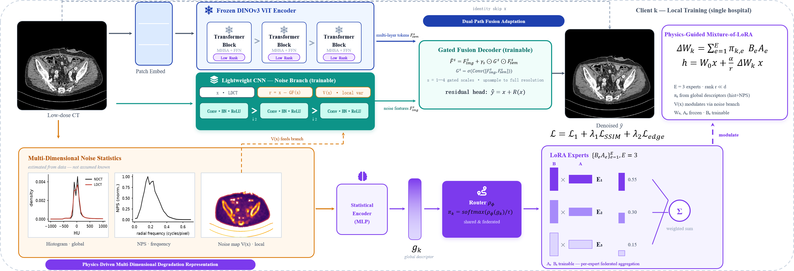

<div align="center">

# 🧬 FedFuse

### Physics-Guided Dual-Path Federated Fine-Tuning for Multi-Center Low-Dose CT Enhancement

[](https://www.python.org/)
[](https://pytorch.org/)
[](#-license)
[](https://ieeeicasp.org/)
[](https://github.com/nsccsuperli/FedFuse)

<p>
  <a href="#-abstract">Abstract</a> •
  <a href="#-highlights">Highlights</a> •
  <a href="#-framework">Framework</a> •
  <a href="#-installation">Installation</a> •
  <a href="#-quick-start">Quick Start</a> •
  <a href="#-citation">Citation</a>
</p>

<br/>



<sub>Figure. Overview of <b>FedFuse</b>: dual-path restoration with a frozen vision foundation model, physics-conditioned image branch, and physics-guided MoE-LoRA federated adaptation.</sub>

</div>

---

## 📖 Abstract

Federated learning enables collaborative low-dose CT (LDCT) enhancement without centralizing raw data. However, existing methods suffer from non-IID data drift across heterogeneous centers, a trade-off between prohibitive parameter overhead and insufficient physical constraints, and a common design tendency that treats CNNs and Transformers as mutually exclusive rather than complementary for LDCT restoration. To address these challenges, we propose **FedFuse**, a novel dual-path framework that integrates a frozen vision foundation model with a lightweight physics-conditioned image branch for multi-center LDCT enhancement. Following this, to capture the spatially-varying noise statistics inherent in LDCT, we extract multi-dimensional degradation representations—global descriptors and local variance maps—directly from low-dose images without requiring protocol metadata or sinogram data. Finally, a physics-guided mixture-of-experts LoRA mechanism orchestrates adaptation: global descriptors govern expert routing and aggregation weights, while local maps spatially modulate adapter outputs. The empirical results emphasize the algorithm's capabilities in mitigating data drift, improving medical image denoising accuracy, and substantially reducing client-side resource overhead through federated multi-expert fine-tuning, where each communication round transmits merely **1.2%** of the full parameter set.

---

## ✨ Highlights

| | |
|:---|:---|
| 🏥 **Privacy-preserving multi-center LDCT** | Collaborative enhancement without sharing raw patient volumes. |
| 🔀 **Dual-path complementarity** | Frozen DINOv3 semantic path + lightweight physics-conditioned CNN path, fused by gated feature modulation. |
| ⚛️ **Physics from images alone** | Global descriptors $(h, \mathrm{NPS})$ and local maps $(r, V(x))$ extracted without protocol metadata or sinograms. |
| 🧩 **Physics-guided MoE-LoRA** | Global descriptors route experts; federated stacking builds a frozen global anchor $(C,D)$ without LoRA averaging bias. |
| 📡 **Ultra-light communication** | Only LoRA factors are exchanged — **~1.2%** of full parameters per round. |

---

## 🏗️ Framework

FedFuse consists of three tightly coupled components (see figure above):

### 1️⃣ Dual-Path Restoration Network
- **Semantic structure path**: frozen DINOv3 ViT with mixture-of-LoRA adapters → multi-scale $F_{\mathrm{sem}}^{s}$
- **Image-domain noise path**: shallow CNN on $[x,\, r(x),\, V(x)]$ → multi-scale $F_{\mathrm{img}}^{s}$
- **Gated fusion + residual decoder**: $\hat{y} = x + R(x)$

### 2️⃣ Multi-Dimensional Degradation Representation
Computed on-GPU from the low-dose image only:
- $r(x) = x - \mathrm{GF}(x)$ — noise residual (guided filter)
- $V(x)$ — local variance map of $r$
- $g = [h;\, \mathrm{NPS}]$ — global descriptor for MoE routing ($\mathbb{R}^{288}$)

### 3️⃣ Federated Multi-Expert Fine-Tuning
- Each client keeps personalized LoRA experts $\{A_e, B_e\}$, router, and local CNN modules
- Server **stacks** (does not average) client factors into a frozen global anchor $(C, D)$
- Broadcast anchor + local personalized branch: $\Delta W_k^{\mathrm{tot}} = \mathrm{scaling}\big(\sum_e \pi_{k,e} B_e A_e + CD\big)$

---

## 📂 Repository Structure

```text
FedFuse/
├── fig6.png                 # Framework overview figure
├── train_federated.py       # Federated training (FedFuse / FedAvg / FedProx)
├── train_central.py         # Centralized training baselines
├── train_local.py           # Single-client / local training
├── train_verify.py          # Verification / sanity runs
├── eval.py                  # PSNR / SSIM / RMSE evaluation + figure export
├── fedfuse/
│   ├── data.py              # Mayo-2016 loaders & non-IID degradation specs
│   ├── physics.py           # Residual, variance, histogram, NPS descriptors
│   ├── losses.py            # L1 + SSIM + edge composite loss
│   ├── metrics.py           # Full-range & body-masked metrics
│   ├── models/
│   │   ├── fedfuse.py       # Dual-path FedFuseNet
│   │   ├── backbone.py      # DINOv3 + MoLoRA injection
│   │   ├── lora.py          # MoE-LoRA + LoRARouter + global anchor
│   │   └── baselines/       # RED-CNN, WGAN-VGG, DUGAN, CTformer
│   └── federated/
│       ├── client.py        # Local update & personalization
│       └── server.py        # Stacking aggregation
├── models/dinov3/           # DINOv3 config (download weights separately)
└── scripts/                 # Analysis, ablations, diagnostics
```

---

## 🛠️ Installation

```bash
# clone
git clone https://github.com/nsccsuperli/FedFuse.git
cd FedFuse

# environment (recommended)
conda create -n fedfuse python=3.10 -y
conda activate fedfuse
pip install torch torchvision --index-url https://download.pytorch.org/whl/cu121
pip install numpy scipy scikit-image tqdm pillow
```

### 📦 DINOv3 Backbone Weights

Place Meta DINOv3 ViT weights under `models/dinov3/` (e.g. `model.safetensors` + `config.json`).  
Large weight files are **not** shipped in this repository — download from the official [DINOv3](https://github.com/facebookresearch/dinov3) / Hugging Face release and keep the local folder layout expected by `--dinov3-path`.

### 🗂️ Dataset

Default experiments use the **Mayo Clinic 2016 LDCT** grand challenge data, preprocessed to:

```text
<data_root>/<PatientID>_<25|target>_<slice>_img.npy   # uint16, 512×512
```

with HU $= \mathrm{raw} - 1024$.  
Default split in code: **8 train patients** (`L067` … `L333`) as clients, **2 test patients** (`L310`, `L506`). Per-client dose / kernel ladders emulate multi-center non-IID degradation.

---

## 🚀 Quick Start

### Federated FedFuse (paper protocol)

```bash
# smoke test
python train_federated.py --method fedfuse --rounds 3 --smoke \
  --data-root /path/to/mayo_2016_npy --out runs/fedfuse_smoke

# full run (K=8, E=3, LoRA rank=8)
python train_federated.py --method fedfuse --rounds 50 --local-epochs 2 \
  --clients 8 --experts 3 --lora-r 8 \
  --data-root /path/to/mayo_2016_npy --out runs/fedfuse
```

### Baselines (FedAvg / FedProx)

```bash
python train_federated.py --method fedavg  --rounds 50 --data-root /path/to/mayo_2016_npy
python train_federated.py --method fedprox --rounds 50 --mu 0.01 --data-root /path/to/mayo_2016_npy
```

### Evaluation

```bash
python eval.py --method fedfuse --ckpt runs/fedfuse/fedfuse_latest.pt \
  --data-root /path/to/mayo_2016_npy --save-figs
```

### Useful Flags

| Flag | Default | Description |
|:-----|:-------:|:------------|
| `--clients` | 8 | Number of federated clients |
| `--experts` | 3 | MoE-LoRA experts per adapted projection |
| `--lora-r` | 8 | LoRA rank |
| `--local-epochs` | 2 | Local epochs per round |
| `--lambda-bal` | 0.01 | Router balance / entropy regularizer |
| `--dinov3-path` | `models/dinov3` | Path to frozen backbone |
| `--smoke` | off | Tiny subset for pipeline checks |

---

## 📊 Design Notes (Implementation ↔ Paper)

| Concept | Code entry |
|:--------|:-----------|
| Dual-path net + gated fusion | `fedfuse/models/fedfuse.py` → `FedFuseNet` |
| Physics descriptors $r, V, g$ | `fedfuse/physics.py` |
| MoE-LoRA + frozen anchor $(C,D)$ | `fedfuse/models/lora.py` → `MoLoRALinear` |
| Stacking aggregation | `fedfuse/federated/server.py` → `FedFuseServer.aggregate` |
| Personalized client update | `fedfuse/federated/client.py` → `FedFuseClient` |
| Non-IID Mayo partitioning | `fedfuse/data.py` → `build_client_datasets` |

> **Communication:** each round uploads LoRA factors $\{A_e, B_e\}$ only; DINOv3 backbone stays frozen and local CNN / fusion / decoder stay on-client.

---

## 🔖 Citation

If you find this repository useful, please cite:

```bibtex
@inproceedings{fedfuse2026,
  title     = {FedFuse: Physics-Guided Dual-Path Federated Fine-Tuning
               for Multi-Center Low-Dose CT Enhancement},
  author    = {nsccsuperli},
  booktitle = {ICASSP},
  year      = {2026}
}
```

> ✏️ Update author list / venue details when the camera-ready version is available.

---

## 🙏 Acknowledgements

- [DINOv3](https://github.com/facebookresearch/dinov3) (Meta AI) for the vision foundation backbone  
- [Mayo Clinic LDCT Grand Challenge](https://www.aapm.org/grandchallenge/lowdosect/) for the public LDCT data  

---

## 📄 License

This repository releases research source code for academic use.  
Third-party components (e.g., DINOv3 weights) remain under their original licenses.

---

<div align="center">

⭐️ If FedFuse helps your research, please consider starring the repo!

</div>
